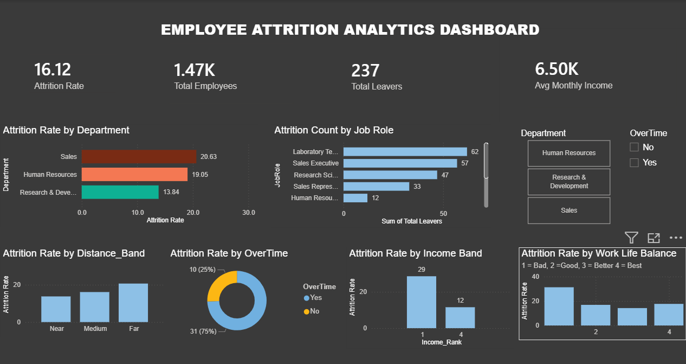

# 🧑‍💼 HR Attrition Analysis — People Analytics Portfolio Project


---

## 📌 Project Overview

This project analyzes employee attrition patterns using the IBM HR Analytics Dataset
(1,470 employees, 35 variables). The goal is to identify key drivers of employee 
turnover and provide data-driven retention recommendations to HR leadership.

**Business Question:**
> *"Which employees are most likely to leave, and what factors drive attrition?"*

---

## 🎯 Objectives

- Identify departments, roles, and demographics with highest attrition risk
- Discover key factors that drive employee turnover
- Build an interactive dashboard for HR decision-makers
- Provide actionable retention recommendations

---

## 🛠️ Tools Used

| Tool | Purpose |
|------|---------|
| Microsoft Excel | Data cleaning, Pivot Table EDA, Charts |
| Power BI | Interactive dashboard & visualizations |
| IBM HR Dataset | Source data (via Kaggle) |

---

## 📁 Repository Structure

```
Attrition-HR-Analytics/
│
├── data/
│   └── HR-Employee-Attrition.xlsx        # Cleaned dataset
│
├── dashboard/
│   ├── Employee_Attrition.pbit           # Power BI Template file
│   ├── Employee_Attrition.pdf            # Exported dashboard (PDF)
│   └── screenshots/
│       └── overview_page.png             # Dashboard Preview
│
├── LICENSE
└── README.md
```

---

## 📊 Dashboard Preview

### Attrition Overview


---

## 🔍 Key Findings

1. **Overall attrition rate is 16.1%** — above the industry benchmark of 10–12%
2. **Sales department** has the highest attrition at ~21%
3. **Overtime employees** are 2x more likely to leave than non-overtime employees
4. **Low job satisfaction + low monthly income** is the strongest combined attrition predictor
5. Employees aged **25–35 with 2–5 years tenure** form the highest-risk group

---

## 💡 HR Recommendations

- Introduce **overtime monitoring policy** — flag employees with 3+ months of consistent overtime
- Revise **compensation bands** for Sales and Lab Technician roles
- Launch **stay interviews** for employees in their 2nd and 3rd year
- Implement **Job Satisfaction pulse surveys** every quarter
- Create **career development paths** for mid-level employees to reduce stagnation

---

## 📂 Dataset

- **Source:** [IBM HR Analytics Employee Attrition Dataset — Kaggle](https://www.kaggle.com/datasets/pavansubhasht/ibm-hr-analytics-attrition-dataset)
- **Records:** 1,470 employees
- **Features:** 35 columns including Age, Department, Job Role, Monthly Income,
  Job Satisfaction, Work-Life Balance, Overtime, and Attrition (target variable)

---

## 👤 About Me

**Gogulnaath**  
MBA — HR & Business Analytics | SRM Institute of Science and Technology, Chennai

Aspiring Data Analyst with domain expertise in People Analytics and HR metrics.
Passionate about using data to solve real-world HR challenges.

🔗 [LinkedIn Profile](https://www.linkedin.com/in/gogulnaath-muthamizhventhanar/)

---

## 📬 Contact

Feel free to connect with me on LinkedIn or raise an issue in this repository
if you have suggestions or feedback on this project!

---
